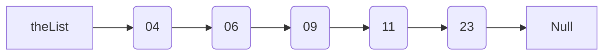
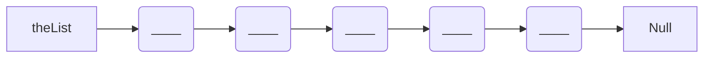
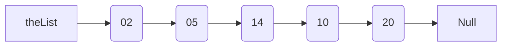

## Test 2 - Linked Lists  

**Name:** __________________________________________


For each of your linked lists, assume the `struct` looks like the following:
```cpp  
struct Node{  
    int data;  
    Node* next;  
}  
```  
----  

**QUESTION 1** 

```cpp  
/**  
* Function: Find()  
* Returns: bool  
* Description: 
* Given a list, and a key to search for, return true if 
* the key is in the list, false otherwise.  
*/  

// Your Code Below:  


```  

**QUESTION 2** 
```cpp  
/**  
* Function: DeleteList()  
* Returns: void  
* Description: 
* Given a list delete all the nodes on the list.  
*/  

// Your Code Below:  


``` 

**QUESTION 3** 

```cpp  
/**  
* Function: Pop()  
* Returns: int  
* Description: 
* Given a list delete, the first node, and return its value. 
*/  

// Your Code Below:  


``` 

**Given:** 

```
// Declare a list
List theList;
theList.orderedInsert(9);
theList.orderedInsert(23);
theList.orderedInsert(11);
theList.orderedInsert(6);
theList.orderedInsert(4);
// Which results in an ordered ascending list:
```


**QUESTION 4**
What will the following code do the the list? 

```cpp
theList->next->next->data = theList->next->next->next->data/3;
theList->data = theList->data + 2;
```



**QUESTION 5**



Use code similar to the question 4's, re-arrange the nodes into proper order (adjust the pointers). Do not try to "loop" or "traverse" the list when fixing.

**QUESTION 6**

```cpp  
/**  
* Function: delete()  
* Returns: void  
* Description: 
* Given a list and a key value, delete the node that is equal to the key.
*/  

// Your Code Below:  


``` 


**QUESTION 7**

```cpp  
/**  
* Function: swapFirstLast()  
* Returns: void  
* Description: 
* Given a list, swap the first and last values in the list.
*/  

// Your Code Below:  


``` 
