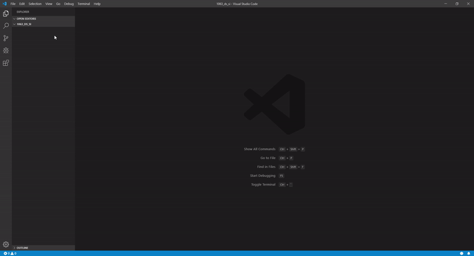
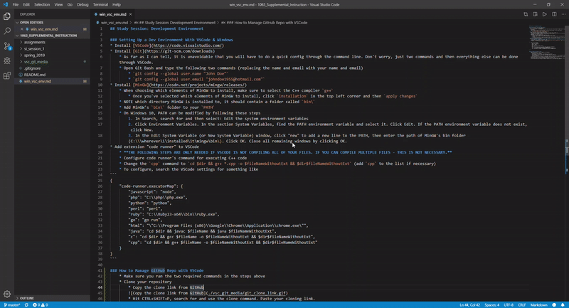
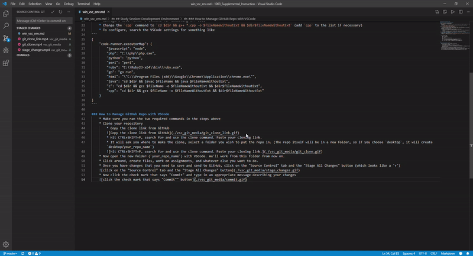
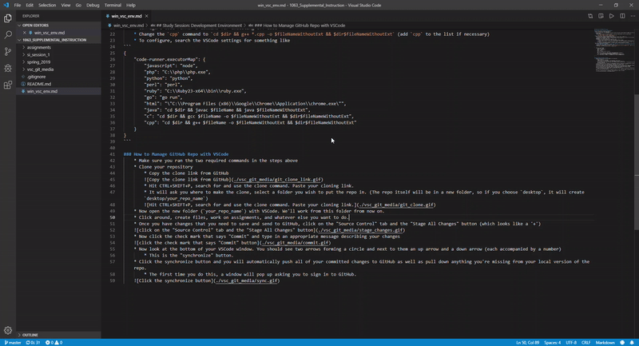

## Study Session: Development Environment

### Setting Up a Dev Environment With VSCode & Windows
* Install [VSCode](https://code.visualstudio.com/)
    * When installing VSCode, I recommend checking the following boxes in addition to the default settings. This is OPTIONAL though.
        * Add "Open With Code" action to Windows Explorer file context menu
        * Add "Open With Code" action to Windows Explorer directory context menu
        * Add to PATH (requires shell restart)
    * The first two options allow you to open VSCode by right clicking in a folder or file. The third option lets you open VSCode from command line using the command `code [folder_path]`.
* Install [Git](https://git-scm.com/downloads)
    * Once Git is installed, we need to configure it to know who you are (Git logs who makes changes to a project). As far as I can tell, it is unavoidable that you will have to do this bit through the command line. Don't worry, just two commands and then everything else can be done through VSCode.
    * Open Git Bash and type the following two commands (replacing the name and email with your name and email)
        * `git config --global user.name "John Doe"`
        * `git config --global user.email "johndoe1955@hotmail.com"`
* Install [MinGW](https://osdn.net/projects/mingw/releases/)
    * When choosing which elements of MinGW to install, make sure to select the C++ compiler `g++`
        * Once you've selected which elements of MinGW to install, click `installation` in the top left corner and then `apply changes`
    * NOTE which directory MinGW is installed to, it should contain a folder called `bin\`
    * Add MinGW's `bin\` folder to your `PATH`
    * On Windows 10, PATH can be modified by following these steps
        1. In Search, search for and then select: Edit the system environment variables
        2. Click Environment Variables. In the section System Variables, find the PATH environment variable and select it. Click Edit. If the PATH environment variable does not exist, click New.
        3. In the Edit System Variable (or New System Variable) window, click "new" to add a new line to the PATH, then enter the path of MinGW's bin folder (C:\\\wherever\i\installed\it\mingw\bin\). Click OK. Close all remaining windows by clicking OK.
* Add extension "code runner" to VSCode
    * To run your code, right click while in the file and select "Run Code"
    * **THE FOLLOWING STEPS ARE ONLY NEEDED IF VSCODE IS NOT COMPILING ALL OF YOUR FILES. IF YOU CAN COMPILE MULTIPLE FILES - THIS IS NOT NECESSARY.**
    * I haven't actually written these steps yet. I wrote something else earlier that wasn't very helpful. If you're reading this, check back in the morning any time after 8AM and I'll have it updated.

### How to Manage GitHub Repo with VSCode
* Make sure you ran the two required commands in the steps above
* Clone your repository
    * Copy the clone link from GitHub
    
    * Hit CTRL+SHIFT+P, search for and use the clone command. Paste your cloning link.
    * It will ask you where to make the clone, select a folder you wish to put the repo in. (The repo itself will be in a new folder, so if you choose `desktop`, it will create `desktop/your_repo_name`)
    
* Now open the new folder (`your_repo_name`) with VSCode. We'll work from this folder from now on.
* Click around, create files, work on assignments, and whatever else you want to do.
* Once you have changes that you need to save and send to GitHub, click on the "Source Control" tab and the "Stage All Changes" button (which looks like a '+')

* Now click the check mark that says "Commit" and type in an appropriate message describing your changes

* Now look at the bottom of your VSCode window. You should see two arrows forming a circle and next to them an up arrow and a down arrow (each accompanied by a number)
    * This is the "synchronize" button.
* Click the synchronize button and you will automatically push all of your committed changes to GitHub as well as pull down anything you're missing from your local version of the repo.
    * The first time you do this, a window will pop up asking you to sign in to GitHub.

